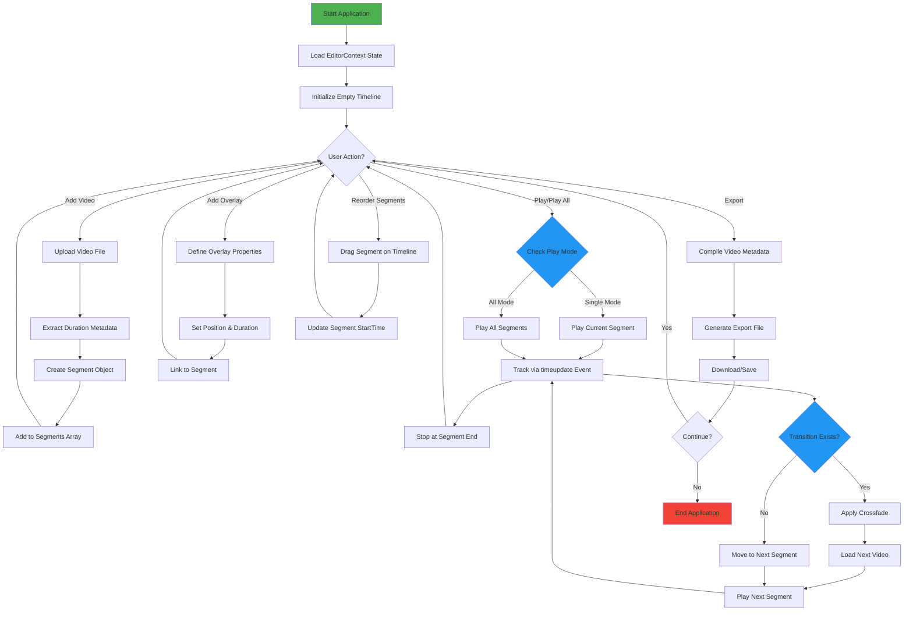

# DNEG Video Editor

A professional video editing application built with React, TypeScript, and Vite. Supports multi-segment video composition, transitions, overlays, and timeline-based editing.

## Prerequisites

Before setting up the project, ensure you have the following installed:

- **Node.js** >= 18.0.0 ([Download](https://nodejs.org/))
- **npm** >= 9.0.0 (comes with Node.js)
- **Git** (for version control)
- **Modern web browser** (Chrome, Firefox, Safari, or Edge)

### Verify Installation

```bash
node --version  # Should be v18.0.0 or higher
npm --version   # Should be 9.0.0 or higher
```

## Setup Instructions

### 1. Clone or Extract the Repository

```bash
https://github.com/Nitin-477/dneg-video-editor.git
```

### 2. Install Dependencies

```bash
npm install
```

This will install all required packages including:

- React 19.2.0
- TypeScript 5.9.3
- Vite 7.2.4
- @dnd-kit for drag-and-drop functionality
- Video.js for video playback
- UUID for unique identifiers

### 3. Development Server

Start the development server with hot module reloading:

```bash
npm run dev
```

The application will be available at `http://localhost:3000`

### 4. Build for Production

```bash
npm run build
```

This creates an optimized build in the `dist/` directory.

### 5. Preview Production Build

```bash
npm run preview
```

### 6. Lint Code

Check for code quality issues:

```bash
npm run lint
```

## Project Structure

```
dneg-video-editor/
├── src/
│   ├── components/
│   │   ├── VideoEditor/        # Main editor component
│   │   ├── Timeline/           # Timeline visualization
│   │   ├── Overlay/            # Overlay management
│   │   └── shared/             # Shared components
│   ├── hooks/                  # Custom React hooks
│   ├── store/                  # State management (EditorContext)
│   ├── types/                  # TypeScript type definitions
│   ├── utils/                  # Utility functions
│   ├── App.tsx                 # Root component
│   └── main.tsx                # Entry point
├── index.html
├── vite.config.ts
├── tsconfig.json
├── eslint.config.js
└── package.json
```

## Key Features

- **Multi-segment video composition**: Combine multiple video files in sequence
- **Timeline-based editing**: Visual timeline with segment management
- **Video transitions**: Crossfade effects between segments
- **Overlay support**: Add text overlays with positioning and timing
- **Drag-and-drop interface**: Intuitive segment reordering
- **Real-time preview**: Live video playback with accurate timing
- **Export functionality**: Save edited compositions
- **Responsive design**: Works on desktop browsers

## Technology Stack

| Technology | Version | Purpose                      |
| ---------- | ------- | ---------------------------- |
| React      | 19.2.0  | UI framework                 |
| TypeScript | 5.9.3   | Type-safe development        |
| Vite       | 7.2.4   | Build tool & dev server      |
| @dnd-kit   | 6.3.1   | Drag-and-drop functionality  |
| Video.js   | 8.23.4  | Advanced video playback      |
| UUID       | 11.0.3  | Unique identifier generation |

## Application Flowchart



## Trade-offs

### 1. **Polling vs Event Listeners**

- **Current Approach**: Mixed polling (16ms interval) + event listeners
- **Trade-off**: Polling provides more control but uses more CPU; event listeners are cleaner but browser timing may be imprecise
- **Mitigation**: Used both for robustness across different video formats

### 2. **Segment Duration Accuracy**

- **Current Approach**: Rounded to 2 decimal places
- **Trade-off**: Millisecond precision vs simplicity in UI
- **Impact**: May lose sub-millisecond accuracy but acceptable for most video use cases

### 3. **Single vs Dual Video Elements**

- **Current Approach**: Dual video elements (current + next) for smooth transitions
- **Trade-off**: Increased memory usage for smoother crossfade transitions
- **Benefit**: Eliminates jarring segment switches; provides professional transitions

### 4. **Client-side Processing Only**

- **Current Approach**: No backend server required
- **Advantage**: Fast, local processing, privacy-respecting
- **Limitation**: Depends on browser capabilities; not suitable for 4K+ resolution videos on low-end devices

### 5. **Browser Memory Constraints**

- **Issue**: Loading multiple large video files simultaneously
- **Current Approach**: Only preload the next segment
- **Trade-off**: Limits smooth preview with many segments but prevents memory overflow

### 6. **Timeline Update Frequency**

- **Current Approach**: Updates every 16ms (60 FPS)
- **Trade-off**: Smooth UI but higher CPU usage
- **Alternative**: Could reduce to 30ms for better battery life but less responsive feel

### 7. **Context API for State Management**

- **Current Approach**: React Context instead of Redux/Zustand
- **Advantage**: Minimal dependencies, easier to learn
- **Limitation**: Potential performance issues with very large projects; harder to debug complex state changes

### 8. **No Server-side Export**

- **Current Approach**: Client-side only with downloadable metadata
- **Trade-off**: Users cannot generate actual video files; only capture composition structure
- **Future Enhancement**: Would require backend with FFmpeg or similar

## Performance Tips

- **Video Codec**: Use H.264 for broader browser compatibility
- **Video Resolution**: Recommend 1080p or lower for smooth playback
- **File Size**: Keep individual segments under 500MB for optimal performance
- **Browser**: Use Chrome/Firefox for best performance; Safari may have playback limitations

## Troubleshooting

### Video Not Playing

- Ensure video format is supported (MP4/WebM recommended)
- Check browser console for error messages
- Try with a different video file

### Lag During Editing

- Close other browser tabs/applications
- Reduce video resolution
- Clear browser cache

### Build Errors

- Delete `node_modules/` folder and run `npm install` again
- Ensure Node.js version is 18+
- Clear npm cache with `npm cache clean --force`
